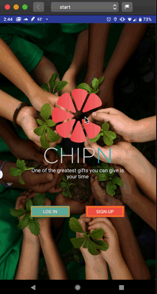

# sketchProjects

Did a simple redesign for the login/onboarding process of the android application ChipN.

I was interested in creating something to link volunteers with volunteer events, and found a version of that idea already out there, so ended up connecting with the founders and doing an initial redesign. This didn't really go anywhere beyond that, but figured I can still show what I did. Built with sketch, and exported out to zeplin project. 

### Original

### Updated

